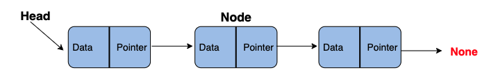
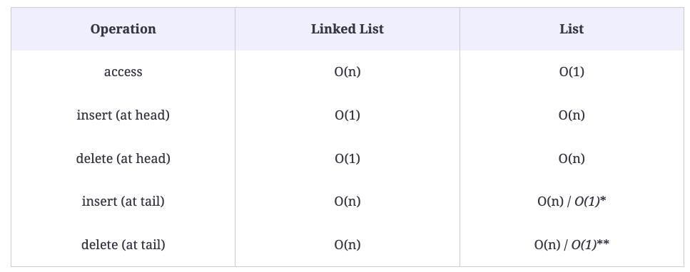

# Software Engineering Interview Questions in Python: Data Structures

This repository deals with data structures, algorithms, software design & Co. in python.

I created it while following the learning path [Ace the Python Coding Interview](https://www.educative.io/path/ace-python-coding-interview) in [educative.io](educative.io).

The path is divided in 7 modules:

1. Data Structures
2. Algorithms
3. Recursion
4. Dynamic Programming
5. Object Oriented Design
6. System Design
7. Concurrency

This file deals with the first module: **Data Structures**.

Mikel Sagardia, 2022.
No guarantees

## Overview of Contents:

1. Lists
2. Linked lists
3. Stacks and Queues
4. Trees
5. Tries
6. Graphs
7. Heaps
8. Hash Tables


## 1. Lists

Note: in python, lists are like arrays; this is abit confusing, since I would have said lists are (linked) lists.

### Lists: Definition

- Sequences of elements of different type
- Slicing: inclusive start, exclusive end
- For loops on lists
- Concatenation

```python
l = [1, 2, 3, 4, 5]
l1 = l[0:2] # [1, 2, 3]
l2 = l[2:4] # [4, 5]
l3 = l1 + l2 # [1, 2, 3, 4, 5]
for i in l:
    print(i)
```

### Challenge 1: Remove Even Integers from List

Solution 1: By Hand, `O(n)`

```python
def remove_even(lst):
    l = []
    for val in lst:
        if val % 2 != 0:
            l.append(val)
    return l
```

Solution 2: List Comprehensions, `O(n)`. This is is the preferred one, because it's more pythonic

```python
def remove_even(lst):
    # newList = [expression(i) for i in oldList if filter(i)]
    # squared_x = [x**2 for x in lst if x % 2 != 0]
    return [number for number in lst if number % 2 != 0]
```

### Challenge 2: Merge Two Sorted Lists

#### Solution 1 (Mine)

My first **wrong** solution: It's not enough to compare elements pairwise - each element needs to be compared against a subset of elements of the other list!

```python
def merge_lists(lst1, lst2):
    if len(lst1) == 0:
        # lest is empty, return the other list
        return lst2
    if len(lst2) == 0:
        return lst1
    else:
        # None of the lists is empty
        # Create an new one that marges both
        m = []
        different_length = False
        # Get shortest list: lstA
        if len(lst1) != len(lst2):
            different_length = True
            if len(lst1) < len(lst2):
                lstA, lstB = lst1, lst2
            else:
                lstA, lstB = lst2, lst1
        else:                
            lstA, lstB = lst1, lst2                            
        # Traverse shortest list (lstA)
        # and compare items to longest
        for i in range(len(lstA)):
            if lstA[i] < lstB[i]:
                m.append(lstA[i])
                m.append(lstB[i])
            else:
                m.append(lstB[i])
                m.append(lstA[i])
        # Rest of longest list needs to be concatenated
        if different_length:
            remainder = lstB[(len(lstA)):]
            m = m + remainder
    return m
```

#### Solution 2 (Mine)

My second **correct** solution: It has some mistakes/improvements:
- I don't need to detect the longest list.
- The complexity is `O(n*m)`, not that good.

```python
def merge_lists(lst1, lst2):
    if len(lst1) == 0:
        # lest is empty, return the other list
        return lst2
    if len(lst2) == 0:
        return lst1
    else:
        # None of the lists is empty
        # Create an new one that marges both
        m = []
        differece_length = abs(len(lst1) - len(lst2))
        # Get shortest list: lstA
        if differece_length > 0:
            if len(lst1) < len(lst2):
                lstA, lstB = lst1, lst2
            else:
                lstA, lstB = lst2, lst1
        else:                
            lstA, lstB = lst1, lst2                            
        # Traverse shortest list (lstA)
        # compare items to longest (lstB)
        # and instert the shortest (A) into the longest (B)
        # Last insertion in lstB
        last_insertion_B = -1
        # Copy lstB, to be merged
        m = lstB
        for i in range(len(lstA)):
            # Traverse rest of lstB/m (longest)
            for j in range(last_insertion_B + 1, len(m)):
                # if current A item is smaller, insert it
                if lstA[i] <= m[j]:
                    m.insert(j, lstA[i])
                    last_insertion_B = j
                    # Break, otherwise inserted for the rest again!
                    break
                # Edge case: we are at the end of m
                elif j == len(m) - 1:
                    m.append(lstA[i])
                    last_insertion_B = len(m) - 1

    return m
```

#### Solution 3 (Provided)

Provided Solution 1:  Time complexity is `O(m(n+m))`, because both lists are not traversed separately.

```python
# Merge list1 and list2 and return resulted list
def merge_lists(lst1, lst2):
    index_arr1 = 0
    index_arr2 = 0
    index_result = 0
    result = []

    for i in range(len(lst1)+len(lst2)):
        result.append(i)
    # Traverse Both lists and insert smaller value from arr1 or arr2
    # into result list and then increment that lists index.
    # If a list is completely traversed, while other one is left then just
    # copy all the remaining elements into result list
    while (index_arr1 < len(lst1)) and (index_arr2 < len(lst2)):
        if (lst1[index_arr1] < lst2[index_arr2]):
            result[index_result] = lst1[index_arr1]
            index_result += 1
            index_arr1 += 1
        else:
            result[index_result] = lst2[index_arr2]
            index_result += 1
            index_arr2 += 1
    while (index_arr1 < len(lst1)):
        result[index_result] = lst1[index_arr1]
        index_result += 1
        index_arr1 += 1
    while (index_arr2 < len(lst2)):
        result[index_result] = lst2[index_arr2]
        index_result += 1
        index_arr2 += 1
    return result

print(merge_lists([4, 5, 6], [-2, -1, 0, 7]))
```

#### Solution 4 (Provided)

Provided Solution 2: Time complexity is `O(m(n+m))`, because both lists are not traversed separately. Also, note that `insert()` can be quadratic. However, the `extend()` function in `O(n)`.

```python
def merge_arrays(lst1, lst2):
    ind1 = 0  # Creating 2 new variable to track the 'current index'
    ind2 = 0
    # While both indeces are less than the length of their lists
    while ind1 < len(lst1) and ind2 < len(lst2):
        # If the current element of list1 is greater
        # than the current element of list2
        if(lst1[ind1] > lst2[ind2]):
            # insert list2's current index to list1
            lst1.insert(ind1, lst2[ind2])
            ind1 += 1  # increment indices
            ind2 += 1
        else:
            ind1 += 1

    if ind2 < len(lst2):  # Append whatever is left of list2 to list1
        lst1.extend(lst2[ind2:])
    return lst1

print(merge_arrays([4, 5, 6], [-2, -1, 0, 7]))
```

### Challenge 3: Find Two Numbers that Add up to `k`

Given a list and a number `k`, find two numbers from the list that sum to `k`.

#### Solution 1 (Mine)

My **first** solution. It iterates the list in two (nested) for-loops, so it's `O(n^2)`:

```python
def find_sum(lst, k):
    for i in lst:
        r = k - i
        for j in lst:
            if r == j:
                return [i,j]
```

#### Solution 2 (Mine)

Another solution, suggested in the course: sort and perform a binary search! Note that:
- `.sort()` is used; since most optimal sorting functions take `O(nlogn)`, we assume it here, too
- Binary search takes `O(logn)`
- Thus: total time: `O(nlogn)`

The following is my approach for binary seach after sorting. I made a **huge mistake**: I forgot checking whether the searched item is in the left or right part of the list (which is why I sort and perform binary search!). Now it's corrected.

```python
# O(logn)
def binary_search(lst_sorted, item):
    length = len(lst_sorted)
    span = int(length / 2) # floor
    found = False
    if span < 2:
        # length = 1 | 2 | 3
        # span = 0 | 1
        if lst_sorted[0] == item:
            found = True
        if span == 1 and (item > lst_sorted[0]):
            # We have already checked lst_sorted[0]
            # Now we check lst_sorted[1], lst_sorted[2]
            found = binary_search(lst_sorted[1:], item)
    else:
        # length > 3
        # span > 1
        if item <= lst_sorted[span]:
            found = binary_search(lst_sorted[:(span+1)], item)
        else:   
            found = binary_search(lst_sorted[(span+1):], item)
    return found

def find_sum(lst, k):
    # We assume sort() works at O(nlogn)
    lst.sort() # inplace, returns None; sort() wort return a sorted list
    # lst_sorted = sort(lst)
    for i in lst:
        r = k - i
        found = binary_search(lst, r)
        if found:
            return [i, r]
```

### Solution 3 (Provided)

The following solution provided in the course uses sorting + binary search; while ny approach used recursion, this approach uses an iterative method.
This approach returns additionally the index where the item is found.

```python
def binary_search(a, item):
    first = 0
    last = len(a) - 1
    found = False
    index = -1
    while first <= last and not found:
        mid = (first + last) // 2 # integer/floor division
        if a[mid] == item:
            index = mid
            found = True
        else:
            # Take the boundaries of the list half
            # that can contain item
            if item < a[mid]:
                last = mid - 1
            else:
                first = mid + 1
    if found:
        return index
    else:
        return -1

def find_sum(lst, k):
    lst.sort()
    for j in range(len(lst)):
        # find the difference in list through binary search
        # return the only if we find an index
        index = binary_search(lst, k -lst[j])
        if index is not -1 and index is not j:
            return [lst[j], k -lst[j]]
    
print(find_sum([1, 5, 3], 2))
print(find_sum([1, 2, 3, 4], 5))
```

#### Solution 4 (Provided)

Provided solution, using moving indices after having ordered the list. The list is traversed start->end and end<-start simultaneously. Since th elist is ordered, we can compute the sum of the items at each step and move indices accordingly. This solution is `O(nlogn)`: sorting `O(nlogn)` and traversing `O(n)`. However, it's not the optimal approach; the optimal approach consists in using hashing (see Challenge 8).

```python
def find_sum(lst, k):
    # sort the list
    lst.sort()
    index1 = 0
    index2 = len(lst) - 1
    result = []
    sum = 0
    # iterate from front and back
    # move accordingly to reach the sum to be equal to k
    # returns false when the two indices meet
    while (index1 != index2):
        sum = lst[index1] + lst[index2]
        if sum < k:
            index1 += 1
        elif sum > k:
            index2 -= 1
        else:
            result.append(lst[index1])
            result.append(lst[index2])
            return result
    return False


print(find_sum([1, 2, 3, 4], 5))
print(find_sum([1, 2, 3, 4], 2))
```

### Challenge 4

Given a list, modify it so that each index stores the product of all elements in the list except the element at the index itself.

#### Solution 1: Naive approach (Mine)

```python
def find_product(lst):
    arr = []
    for i in range(len(lst)):
        item = 1
        for j in range(len(lst)):
            if j != i:
                item *= lst[j]
        arr.append(item)
    return arr
```

#### Solution 2: Keeping Track of Previous Products (Mine)

```python
def find_product(lst):
    arr = list(range(len(lst)))
    previous_non_zero = -1
    for i in range(len(lst)):
        item = 1
        if previous_non_zero != -1:
            # arr[previous_non_zero] != 0 by definition
            # lst[i] != 0 if previous_non_zero != -1
            item = lst[previous_non_zero] * (arr[previous_non_zero] / lst[i])
        else: # previous_non_zero == -1
            for j in range(len(lst)):
                if j != i:
                    if lst[j] != 0:
                        item *= lst[j]
                    else:
                        item = 0
                        break
        arr[i] = item
        if item != 0:
            previous_non_zero = i
    return arr
```

#### Solutuon 3: Left Side Product Tracked (Provided)

We track the prodcut of the left side and compute for each item the product of the right side.  
Thus, we have two for loops: a loop fpr all items and a loop for the items on the right side.

The complexity is `O(n^2)`.

```python
def find_product(lst):
    result = []
    left = 1  # To store product of all previous values from currentIndex
    for i in range(len(lst)):
        currentproduct = 1  # To store current product for index i
        # compute product of values to the right of i index of list
        for ele in lst[i+1:]:
            currentproduct = currentproduct * ele
        # currentproduct * product of all values to the left of i index
        result.append(currentproduct * left)
        # Updating `left`
        left = left * lst[i]

    return result
```

#### Solution 4: Product from Left Multiplied by Product from Right (Provided)

Very nice solution: first the products from the left are computed by tracking them; then the sam eis done from the right!

We just traverse 2x the list, without nested for loops; thus, the time complexity is `O(n)`!

```python
def find_product(lst):
    # get product start from left
    left = 1
    product = []
    for ele in lst:
        product.append(left)
        left = left * ele
    # get product starting from right
    right = 1
    for i in range(len(lst)-1, -1, -1):
        product[i] = product[i] * right
        right = right * lst[i]

    return product
```

### Challenge 5: Find Minimum Value in List

Given a list of `n` integers, find the minimum value in the list.

#### Solution 1: Iterate all Elements and Track Minimum (Mine)

Very easy - so easy I though I didn't understand the task. `O(n)`.

```python
def find_minimum(arr):
    if len(arr) > 0:
        min_value = arr[0]
        for i in range(1,len(arr)):
            if arr[i] < min_value:
                min_value = arr[i]
        return min_value
    else:
        return None
```

#### Solution 2: Sort the List and Take First Element (Suggested)

I don't quite understand why the suggest this as a solution, since it's more complex and it takes `O(nlogn)`.

Merge Sort Algorithm:

- `O(nlogn)`
- Can be used on any traversable structure
- Divide list/array in halves recursuvely top-down
- Bottom-up: sort elemenst and merge

Merge sort implemented by me:

```python
def find_minimum(lst):
    if len(lst) > 0:
        lst_sorted = merge_sort(lst)
        return lst_sorted[0]
    else:
        return None

def merge_sort(lst):
    # Merge Sort by Me
    length = len(lst)
    if length > 1:
        # Split
        half = length // 2 # int division, floor        
        left = lst[:half]
        right = lst[half:]
        left_sorted = merge_sort(left)
        right_sorted = merge_sort(right)
        # Merge: 2 ordered lists
        # We advance in 3 arrays, and compare left-right
        # elements one by one;
        # then, rest needs to be appended
        arr = [None] * length
        i = 0
        j = 0
        k = 0
        while i < (half) and j < (length-half):
            if left_sorted[i] < right_sorted[j]:
                arr[k] = left_sorted[i]
                i += 1
            else:
                arr[k] = right_sorted[j]
                j += 1
            k += 1
        # Append reminder: could be either right or left!
        if i != half:
            arr[k:] = left_sorted[i:]
        elif j != (length-half):
            arr[k:] = right_sorted[j:]
        return arr
    else:
        return lst

print(find_minimum([0, 10, 1, -1, -2]))
```

Merge sort as provided:


```python
def merge_sort(my_list):
    if len(my_list) > 1:
        mid = len(my_list) // 2
        left = my_list[:mid]
        right = my_list[mid:]

        # Recursive call on each half
        merge_sort(left)
        merge_sort(right)

        # Two iterators for traversing the two halves
        i = 0
        j = 0
        
        # Iterator for the main list
        k = 0
        
        while i < len(left) and j < len(right):
            if left[i] < right[j]:
              # The value from the left half has been used
              my_list[k] = left[i]
              # Move the iterator forward
              i += 1
            else:
                my_list[k] = right[j]
                j += 1
            # Move to the next slot
            k += 1

        # For all the remaining values
        while i < len(left):
            my_list[k] = left[i]
            i += 1
            k += 1

        while j < len(right):
            my_list[k]=right[j]
            j += 1
            k += 1


def find_minimum(lst):
    if (len(lst) <= 0):
        return None
    merge_sort(lst)  # sort list
    return lst[0]  # return first element
```

### Challenge 7: Find Second Maximum Value in a List

(There seems to be no Challenge 6)

Given a list of size `n`, find the second maximum element in the list.

#### Solution 1 (Mine): Traverse the list once and track both the max and the 2nd max

The solution is straightforward; the only issue are the edge cases and the fact that we need to swap the old max if a bigger one is found.  
Time complexity: `O(n)`

```python
def find_second_maximum(lst):
    if len(lst) < 1:
        return None
    elif len(lst) < 2:
        return lst[0]
    else:
        # Pick first 2 elements
        if lst[0] > lst[1]:
            max_1 = lst[0]
            max_2 = lst[1]
        else:
            max_1 = lst[1]
            max_2 = lst[0]
        if len(lst) > 2:
            # Loop in rest of array
            for i in range(2,len(lst)):
                if lst[i] > max_1:
                    # Keep old max as 2nd max
                    max_2 = max_1
                    max_1 = lst[i]
                elif lst[i] > max_2:
                    max_2 = lst[i]
        return max_2 
```

#### Provided Solutions

Three solutions are provided: one similar to mine, the other two worse:

- Sort list and index second max.
- Traverse list twice: first to get the max, second to get the second biggest.

Solution similar to mine:

```python
def find_second_maximum(lst):
   if (len(lst) < 2):
       return
   # initialize the two to infinity
   max_no = second_max_no = float('-inf')
   for i in range(len(lst)):
       # update the max_no if max_no value found
       if (lst[i] > max_no):
           second_max_no = max_no
           max_no = lst[i]
       # check if it is the second_max_no and not equal to max_no
       elif (lst[i] > second_max_no and lst[i] != max_no):
           second_max_no = lst[i]
   if (second_max_no == float('-inf')):
       return
   else:
       return second_max_no
```

Note: notice the use of `float(-inf)`.

### Challenge 8: Right Rotate List

Given a list of length `n` rotate its elements by `k` indices from right to left.

#### Solution 1: Cut left & right and swap + fill gaps (Mine)

I spent more than expected with this challenges because I often mess up with slicing indices.

The concept is easy: I cut at `k` the left and right parts and I swap them; since we're going to have gaps or too long lists, they need to be further cut to make them fit. The time complexity is `O(n)` worst case, assuming that the slicing needs to go through all elements.

```python
def right_rotate(lst, k):
    if len(lst) < 1:
        return lst
    else:
        if k >= len(lst):
            # Pick the division rest / modulo
            k = k % len(lst)
        if k == 0:
            return lst
        else:
            # Initialize memory
            arr = [None] * len(lst)
            # Cut list
            lst_left = lst[:k] # k
            lst_right = lst[k:] # len(lst) - k
            # Left is shifted to position k
            # We choose to break lst_left or lst_right
            # depending on their sizes.
            if len(lst) - k - len(lst_left) >= 0: # len(lst_left) = k
                # lst_left is too short (or perfect) to fill
                # the right of arr; break lst_right if lst_left too shot
                # Empty space length on arr_right
                diff = len(lst) - k - len(lst_left)
                # arr_right
                arr[k:] = lst_left + lst_right[:diff]
                # arr_left
                arr[:k] = lst_right[diff:]
            else:
                # lst_left is larger
                # than the right of arr, or the same size
                # Too much length on arr_right
                break_left = len(lst_right) # len(lst) - k
                # arr_right
                arr[k:] = lst_left[:break_left]
                # arr_left
                arr[:k] = lst_left[break_left:] + lst_right

            return arr
```

#### Solution 2: Manual Rotation (Provided)

Time complexity: `O(n)`.

```python
def right_rotate(lst, k): 
    if len(lst) == 0:
        k = 0
    else:
        k = k % len(lst)
    rotatedList = []
    # get the elements from the end
    for item in range(len(lst) - k, len(lst)):
        rotatedList.append(lst[item])
    # get the remaining elements
    for item in range(0, len(lst) - k):
        rotatedList.append(lst[item])
    return rotatedList
```

#### Solution 3: Pythonic Rotation

Very elegant. Think in python!

```python
def right_rotate(lst, k):
    # get rotation index
    if len(lst) == 0:
        k = 0
    else:
        k = k % len(lst)
    return lst[-k:] + lst[:-k]
```

### Challenge 9: Re-Arrange Positive and Negative Values

Given a list of `n` elements, rearrange its elements in such a way that the negative elements appear at one end and positive elements appear at the other.

#### Solution 1: Loop List and Create 2 Lists to Concatenate Them (Mine)

Straightforward, using auxiliary lists.

Time complexity: `O(n)`.

```python
def rearrange(lst):
    left = []
    right = []
    for item in lst:
        if item < 0:
            left.append(item)
        else:
            right.append(item)
    return left+right
```

#### Solution 2: Re-Arrange in Place (Suggested, Mine + Provided)

```python
def swap(l,r,lst):
    # Since list is a mutable,
    # we pass by value its reference;
    # thus, we can change its elemenets with 'append(), []'
    # and it's reflected outside.
    # But if we re-assign its values 'lst = [...]'
    # it won't be reflected unless we do 'return lst'
    tmp = lst[l]
    lst[l] = lst[r]
    lst[r] = tmp

def rearrange(lst):
    last_negative = -1
    for i in range(len(lst)):
        if lst[i] < 0:
            last_negative += 1
            swap(last_negative,i,lst)
    return lst
```

The answer can be more pythonic using tuple unpacking!  
We don't need to use `tmp` in `swap()`!

```python
def rearrange(lst):
    leftMostPosEle = 0  # index of left most element
    # iterate the list
    for curr in range(len(lst)):
        # if negative number
        if lst[curr] < 0:
            # if not the last negative number
            if curr != leftMostPosEle:
                # swap the two
                lst[curr], lst[leftMostPosEle] = lst[leftMostPosEle], lst[curr]
            # update the last position
            leftMostPosEle += 1
    return lst
```

#### Solution 3: Pythonic Auxiliary Lists (Provided)

```python
def rearrange(lst):
    # get negative and positive list after filter and then merge
    return [i for i in lst if i < 0] + [i for i in lst if i >= 0]
```

### Challenge 10: Rearrange Sorted List in Max/Min Form

Arrange elements in such a way that the maximum element appears at first position, then minimum at second, then second maximum at third and second minimum at fourth and so on.

```
[1,2,3,4,5] -> [5,1,4,2,3]
```

#### Solution 1: Sort + Iterate in Both Directions (Mine)

One solution is to sort the list and then iterate over its elements from both ends.

Time complexity: sort `O(nlog)` + `O(n)` iterate on both ends -> `O(nlogn)`.

Note: I didn't read it, but the list is supposed to be ordered already.  
Thus, we don't need the `merge_sort()`.

```python
def merge_sort(lst):
    if len(lst) < 2:
        return lst
    else:
        # Split
        mid = len(lst) // 2 # floor
        left = lst[:mid]
        right = lst[mid:]
        # Sort each half
        left_sorted = merge_sort(left)
        right_sorted = merge_sort(right)
        # Merge 
        i, j = 0, 0
        k = 0
        lst_sorted = [None] * len(lst)
        #while i in range(len(left_sorted)) and j in range(len(right_sorted)):
        while i < len(left_sorted) and j < len(right_sorted):
            if left_sorted[i] < right_sorted[j]:
                lst_sorted[k] = left_sorted[i]
                i += 1
            else:
                lst_sorted[k] = right_sorted[j]
                j += 1
            k += 1
        # Add remainder
        if i < len(left_sorted):
            # We have not taken all items from left_sorted
            # instead, all from right_sorted were taken.
            # This cannot happen! But anyways
            lst_sorted[k:] = left_sorted[i:]
        elif j < len(right_sorted):
            # We have not taken all items from right_sorted
            # instead, all from left_sorted were taken.
            lst_sorted[k:] = right_sorted[j:]
        
        return lst_sorted

def max_min(lst):
    # Sort
    lst_sorted = merge_sort(lst)
    
    # Iterate in both directions and pick max & min
    min_max_lst = [None] * len(lst_sorted)
    i = 0
    l, r = 0, len(lst_sorted)-1
    while i < len(lst_sorted) and l < len(lst_sorted) and r > -1:
        if i % 2 == 0:
            # even: max
            min_max_lst[i] = lst_sorted[r]
            r -= 1
        else:
            # odd: min
            min_max_lst[i] = lst_sorted[l]
            l += 1
        i += 1

    # Check and add remainder
    # We really don't need this, 
    # because we keep picking values
    # until i == len(lst_sorted) occurs 
    #if l < len(lst_sorted) and r == -1:
    #    # l is yet to be finished
    #    min_max_lst[i:] = lst_sorted[l:]
    #elif r > -1 and l == len(lst_sorted):
    #    # r is yet to be finished
    #    min_max_lst[i:] = lst_sorted[r::-1] # invert [:r]

    return min_max_lst

```

#### Solution 2: Iterate in Two Directions Simultanously in a Pythonic Way (Provided)

This solution is similar to mine, but the pythonic way of accessing backwards is exploited: `lst[-i] == lst[len(lst)-i], i > 0`.

Time complexity: `O(n)`.

```python
def max_min(lst):
    result = []
    # iterate half list
    for i in range(len(lst)//2):
        # Append corresponding last element: max
        result.append(lst[-(i+1)])
        # append current element: min
        result.append(lst[i])
    if len(lst) % 2 == 1:
        # if middle value then append: it will be last min
        result.append(lst[len(lst)//2])
    return result
```

#### Solution 3: Modulus Operator

The modulus operator `%` has two very interesting properties. Take the ordered list `lst = [1, 2, 3, 4, 5, 6]`; if we take `max = lst[-1] + 1`, then this is true

1. `lst[i] % max == lst[i]`, for any `i in range(len(lest))`
2. `lst[i] + max*k % max == lst[i]`, for any `i in range(len(lest))` and any integer `k > 0`

These properties are exploited to perform the following; lest consider `lst[0]`: 

> We need to store 6 at index 0 , since that is the maximum value in the list. Multiply 6 with 7 and add lst[0] to it, we get 7 * 6 + 1 = 43. For our last trick, when we apply 43 % 7, we get back the original 1. At the same time, if we divide divide 43 by 7, we get back 6.
> This is the line `lst[i] += (lst[maxIdx] % maxElem) * maxElem`.

Thus, 43 stores both the new element and the old! `43/7 = 6`, `43%7 = 1`.

```python
def max_min(lst):
    # Return empty list for empty list
    if (len(lst) is 0):
        return []

    maxIdx = len(lst) - 1  # max index
    minIdx = 0  # first index
    maxElem = lst[-1] + 1  # Max element
    # traverse the list
    for i in range(len(lst)):
        # even number means max element to append
        if i % 2 == 0:
            lst[i] += (lst[maxIdx] % maxElem) * maxElem
            maxIdx -= 1
        # odd number means min number
        else:
            lst[i] += (lst[minIdx] % maxElem) * maxElem
            minIdx += 1

    for i in range(len(lst)):
        lst[i] = lst[i] // maxElem
    return lst

```

### Challenge 11: Maximum Sum Sublist

Given an array, find the contiguous sublist (contiguous elements) with the largest sum; the list might have negative numbers anywhere.

#### Solution 1: Find First Positive and Expand (Mine)

This solution seems to work, but it would not work in all cases.

For instance: `[10, -1, -1, -1, 100]`: the maximum sublist is the entire array: `117`; however, `100` is returned.

One fix would be to colapse all positive and negative sublists and find the maximum on that collapsed list?

My algorithmin `O(n)`

```python
def find_max_sum_sublist(lst): 
    # Check if all are negative / 0
    max_number = lst[0]
    first_positive = -1
    for i in range(len(lst)):
        if lst[i] > 0:
            first_positive = i
            break
        else:
            if lst[i] > max_number:
                max_number = lst[i]
    if first_positive < 0:
        return max_number
    
    # If here, there are >0 elements
    # ie., first_positive > -1
    
    start = first_positive
    end = first_positive+1
    s = lst[start]
    sublists = []
    negatives = []
    if end == len(lst):
        # We reached end
        return s
    else:
        for i in range(start,len(lst)):
            # start is defined, find end
            s = lst[start]
            for j in range(start+1,len(lst)):
                if lst[j] > 0:
                    # extend end
                    s += lst[j]
                    end = j+1
                else:
                    # one sublist found
                    end = j
                    negatives.append((j, lst[j]))
                    break
            sublists.append((start, end, s))
            start = end+1
            # Check we're not at the end
            if start > len(lst):
                break
            else:
                # Find next first positive == start
                for j in range(start,len(lst)):
                    if lst[j] > 0:
                        start = j
                        break
                    else:
                        negatives.append((j, lst[j]))
        # We have all sublists and their sums
        max_sum = -1
        for start, end, s in sublists:
            if max_sum < s:
                max_sum = s
        return max_sum
```

#### Solution 2: Kanade's Algorithm (Dynamic Programming)

Elegant way of computing the contiguoous sublist with the maxiumum sum, `O(n)`.

A global best option is tracked as well as a current sublist sum.

We scan the entire list and at each position find the maximum sum of the sublist ending there.

```python
def find_max_sum_sublist(lst): 
    if (len(lst) < 1): 
        return 0;

    curr_max = lst[0];
    global_max = lst[0];
    length_array = len(lst);
    for i in range(1, length_array):
        if curr_max < 0: 
            curr_max = lst[i]
        else:
            curr_max += lst[i]
        if global_max < curr_max:
            global_max = curr_max

    return global_max;
```

### Notes

- The objects of lists themselves are stored in random memory locations whereas the pointers that make up the list are stored in sequential locations.
- Difference between arrays and python lists: Python lists are not type specific
- Functions receive arguments by value, but pointers of objects are passed, so we can modify outer lists; exception: if we reassign teh value of a list, it's not reflected outside

```python
def foo(value, lst):
    value = 1
    lst[0] = 44

v = 3
lst = [1, 2, 3]
foo(v, lst)
print(v, lst[0]) # 3 44
```

- What will output this?

```python
list = [[[1, 2], [3, 4]], [[5, 6], [7, 8]]]
def foo(m):
  v = m[0][0]
  for row in m:
    for element in row:
      if v < element: v = element
  return v

print(foo(list[0])) # 4
```

- What will output this?

```python
def f(i, values = []):
    values.append(i)
    print (values),
    return values
f(1) # [1]
f(2) # [1, 2]
f(3) # [1, 2, 3]
```

- What should output this?

```python
lst = [[1, 2, 3, 4],
       [4, 5, 6, 7],
       [8, 9, 10, 11],
       [12, 13, 14, 15]]

for i in range(0, 4):
    print(lst[i].pop()) # 4 7 11 15
```

## 2. Linked lists

In python, there is no native linked list structure, so we need to implement them.

Structure of a linked list:



We have nodes, which contain the data and a pointer to the next node; if we have only a pointer to the next node, we have a singly linked list, i.e., we can do only a unidirectional traverse.

The implementation is realized with two classes: `Node` and `LinkedList`.

```python
class Node:
    def __init__(self, data):
        self.data = data  # Data field
        self.next_element = None  # Pointer to next node

# To be extended...
class LinkedList:
    def __init__(self):
        self.head_node = None
```

### 2.1 Performance Comparison: List vs. Linked List

In lists (arrays), elements are stored contiguously, while in linked lists successive elements might be anywhere in memory (thus, we need to pointers).

In python, the insertion/deletion (`append() / pop()`) of elements at the tail of a list is `O(1)`; I understand that's because it is amortized time (i.e., the capacity is doubled when exceeded). Thus, the only advantage of linked lists compared to lists would be `O(1)` insertion at any random position.




### 2.2 Implementation of a Singly Linked List

Basic operations: 

- `get_head()` - returns the head of the list
- `insert_at_tail(data)` - inserts an element at the end of the linked list
- `insert_at_head(data)` - inserts an element at the start/head of the linked list
- `delete(data)` - deletes an element with your specified value from the linked list
- `delete_at_head()` - deletes the first element of the list
- `search(data)` - searches for an element with the specified value in the linked list
- `is_empty()` - returns true if the linked list is empty

#### My Implementation

```python

```

