# Python for Algorithms, Data-Structures, and Interviews

This repository contains a compilation of algorithm & data structure implementations in python. I forked it originally from a repository by J.M. Portilla, who has a Udemy course on the topic:

[Python for Algorithms, Data-Structures, and Interviews](https://www.udemy.com/course/python-for-data-structures-algorithms-and-interviews)

I added comments and alternative implementations in some cases.

:warning: This repository is some kind of sandbox where I try things, so if don't expect it to be tidy and 100% PEP8-compliant :stuck_out_tongue_winking_eye:.

The present file is a non-exhaustive guide of the repository and the course.

Another related repository of mine is [python_interviews](https://github.com/mxagar/python_interviews). I created that repository while following the course / learning path [Ace the Python Coding Interview](https://www.educative.io/path/ace-python-coding-interview) in [educative.io](educative.io).

## Overview of Contents

- [Python for Algorithms, Data-Structures, and Interviews](#python-for-algorithms-data-structures-and-interviews)
  - [Overview of Contents](#overview-of-contents)
  - [1. Algorithm Analysis and Big O](#1-algorithm-analysis-and-big-o)
    - [Complexity of Python Data Structures](#complexity-of-python-data-structures)
    - [Some Summary Figures](#some-summary-figures)
    - [Interesting Links](#interesting-links)
  - [2. Array Sequences](#2-array-sequences)
    - [Basics](#basics)
    - [Dynamic Arrays](#dynamic-arrays)
    - [Array Exercises](#array-exercises)
  - [3. Stacks, Queues and Deques](#3-stacks-queues-and-deques)
    - [Stacks](#stacks)
    - [Queues](#queues)
    - [Deques](#deques)
    - [Stack \& Queue Exercises](#stack--queue-exercises)
  - [4. Linked Lists](#4-linked-lists)
    - [Singly Linked Lists](#singly-linked-lists)
    - [Doubly Linked Lists](#doubly-linked-lists)
    - [List Exercises](#list-exercises)
  - [5. Recursion](#5-recursion)
    - [Recursion Basics](#recursion-basics)
    - [Memoization and Dynamic Programming](#memoization-and-dynamic-programming)
    - [Recursion Exercises](#recursion-exercises)
  - [6. Trees](#6-trees)
    - [Basics and Implementation](#basics-and-implementation)
    - [Traversals](#traversals)
    - [Priority Queues with Binary Heaps](#priority-queues-with-binary-heaps)
      - [Tree structure and node localization](#tree-structure-and-node-localization)
      - [Insertion of nodes](#insertion-of-nodes)
      - [Delete minimum value](#delete-minimum-value)
      - [Create a heap from a list](#create-a-heap-from-a-list)
      - [Final class with all the algorithms](#final-class-with-all-the-algorithms)
    - [Binary Search Trees (BST)](#binary-search-trees-bst)
      - [Insert a node](#insert-a-node)
      - [Retrieve a value](#retrieve-a-value)
      - [Delete a node](#delete-a-node)
      - [BST implementation code](#bst-implementation-code)
    - [Tree Exercises](#tree-exercises)
  - [7. Searching and Sorting](#7-searching-and-sorting)
  - [8. Graph Algorithms](#8-graph-algorithms)
  - [9. Riddles](#9-riddles)
  - [10. Python Tips \& Tricks](#10-python-tips--tricks)
    - [Interesting Articles, Links](#interesting-articles-links)
    - [Python Tools](#python-tools)
    - [Testing](#testing)
    - [Tricks](#tricks)
  - [11. Other Topics](#11-other-topics)
    - [Salary Negotiation](#salary-negotiation)
    - [Job Search Platforms](#job-search-platforms)
    - [Typical Behavioral Questions](#typical-behavioral-questions)
    - [Questions I Got Asked](#questions-i-got-asked)

## 1. Algorithm Analysis and Big O

> Big-O notation describes how quickly runtime will grow relative to the input as the input get arbitrarily large.

- We focus on the term with the largest degree for `n`.
- Added or multiplied constants are dropped: `O(2n) -> O(n)`.

Related topics to consider:

- We distinguish between worst, average and best cases; each case can have a different `O()`. Example algorithm that finds a match in a list:
  - Best case: `O(1)`, because the matched element is the first. **Try to always comment best cases**.
  - Worst case: `O(n)`, because the matched element is the last.
- Space complexity: related to memory allocation instead of time complexity.

### Complexity of Python Data Structures

Lists:

```python
# Slow
def method1():
    l = []
    for n in range(10000):
        l = l + [n]

# Faster
def method2():
    l = []
    for n in range(10000):
        l.append(n)

# Even faster
def method3():
    l = [n for n in range(10000)]

# Fastest!
def method4():
    l = list(range(10000))
```

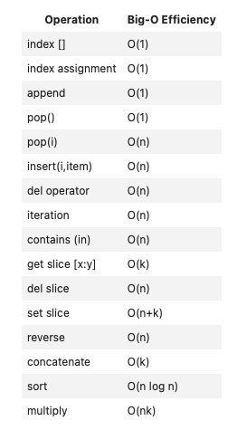

Dictionaries = hash tables.

```python
d = {'k1':1, 'k2':2}
d['k1'] # 1
```

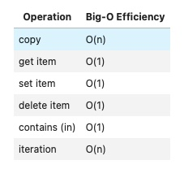

### Some Summary Figures

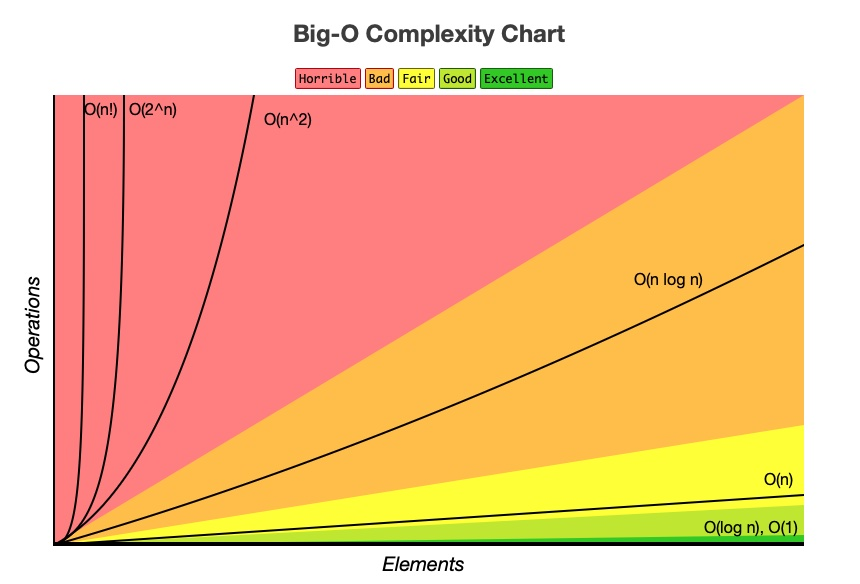

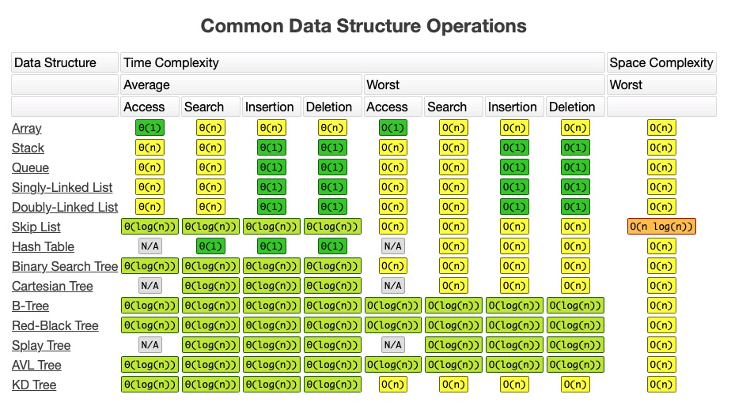

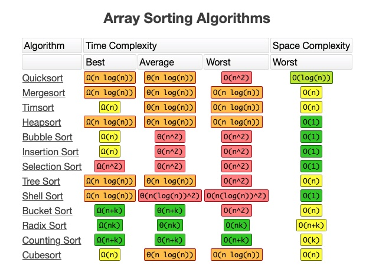

### Interesting Links

- [Big O in Plain English](https://stackoverflow.com/questions/487258/what-is-a-plain-english-explanation-of-big-o-notation/487278#487278).
- [Explanation of O log n](https://stackoverflow.com/questions/2307283/what-does-olog-n-mean-exactly).
- [Big-O Cheat Sheet](https://www.bigocheatsheet.com/).

## 2. Array Sequences

### Basics

- Arrays = in Python, Sequences, which can be
  - Lists
  - Tuples
  - Strings
- Arrays are collections of elements/objects that are stored in contiguous memory cells.
  - All cells have the same size.
  - `O(1)` access.
- Referential arrays: slices; they are pointers to the original objects!
- Mutable and immutable: can change or not; references are converted to new objects if we assign anew immutable to a referenced cell.
  - Mutable: lists, sets, dicts
  - Immutable: numbers, strings, tuples, frozen sets
- `append()` vs `extend()`
  - `append()`: appends a specified object at the end of the list.
  - `extend()`: extends the list by appending elements from the specified iterable. But references are added if we're using immutables, not new objects.

```python
# Slicing is referential: we have pointers to original objects
# That is, we're not creating new objects
temp = primes[3:6]
# But, if we change something in temp, a new object is created for that cell
# if the objects are IMMUTABLE
temp[2] = 15 # primes is unchanged is we assign an immutable
# Shallow copy: references to original objects!
backup = list(primes)
# Deep copy: new list/array with new objects
from copy import deepcopy
backup = deepcopy(primes)
# All 4 cells reference the same object!
counters = [0]*4 # [0,0,0,0]
# But, if we add a value to one cell, a new object is created for that cell
# if the objects are IMMUTABLE
counters[2] += 1 # [0,0,1,0]
# Extend takes references to original objects
prime.extend(extras)
```

### Dynamic Arrays

- Dynamic arrays: we can add elements to the array.
  - When an array is initiated, it has more capacity than its size.
- Memory is allocated first and if we append new immutables, 50%-%100 of current allocation is added every n additions. In theory, doubling the size when we run out of capacity leads to an amortized runtime of `O(1)*` for addition of elements to an array.

```python
import sys

data = []
len(data) # 0

# Size in bytes: Capacity
sys.getsizeof(data) # 64, even though it contains nothing
data.append(1) # [1]
sys.getsizeof(data) # 96
```

- If we want to **manually** extend an array `a`:
  - Allocate new array `b` with larger capacity.
  - `b[i] = a[i]` and `a = b`.
  - Assign new element to `b` after last cell counter of `a`.
  - Free the old array `a`, typically handled by the garbage collector.
- Exercise in which that manual allocation is implemented: [`Dynamic Array Exercise.ipynb`](./Array%20Sequences/Dynamic%20Array%20Exercise.ipynb)
- Amortization: if we extend the capacity by doubling the current one, we achieve an amortized extension complexity of `O(1)*`.

### Array Exercises

The exercises with solutions and comments are located in [`Array Sequences`](./Array%20Sequences/):

- [`Anagram Check - SOLUTION.ipynb`](Array%20Sequences/Array%20Sequence%20Interview%20Questions%20-%20SOLUTIONS/Anagram%20Check%20-%20SOLUTION.ipynb)
  - Problem: Given two strings, check to see if they are anagrams.
  - Solution 1: Sort and compare strings.
  - Solution 2: Count dictionary: count adding with first string, subtract with second.
- [`Array Pair Sum - SOLUTION.ipynb`](./Array%20Sequences/Array%20Sequence%20Interview%20Questions%20-%20SOLUTIONS/Array%20Pair%20Sum%20-%20SOLUTION.ipynb)
  - Problem: Given an integer array, output all the *unique* pairs that sum up to a specific value `k`.
  - Solution: Iterate once array and check if difference to target is in array, using sets. Build a set of unique pairs.
- [`Find the Missing Element - SOLUTION.ipynb`](./Array%20Sequences/Array%20Sequence%20Interview%20Questions%20-%20SOLUTIONS/Find%20the%20Missing%20Element%20-%20SOLUTION.ipynb)
  - Problem: Consider an array of non-negative integers. A second array is formed by shuffling the elements of the first array and deleting a random element. Given these two arrays, find which element is missing in the second array.
  - Solution 1: sum both arrays and subtract; difference is missing value.
  - Solution 2: Sort array and check zipped pairs; when different, we have missing value.
  - Solution 3: count item occurrences in short array and then compare them to the ones in long array
- [`Largest Continuous Sum - SOLUTION.ipynb`](./Array%20Sequences/Array%20Sequence%20Interview%20Questions%20-%20SOLUTIONS/Largest%20Continuous%20Sum%20-%20SOLUTION.ipynb)
  - Problem: Given an array of integers (positive and negative) find the largest continuous sum.
  - Solution: Start summing max value so far, reset continuous sum is it starts decreasing, update maximum value if current sum is bigger.
- [`Sentence Reversal - SOLUTION.ipynb`](./Array%20Sequences/Array%20Sequence%20Interview%20Questions%20-%20SOLUTIONS/Sentence%20Reversal%20-%20SOLUTION.ipynb)
  - Problem: Given a string of words, reverse all the words.
  - Solution: Slice words, reverse list.
- [`String Compression - SOLUTION.ipynb`](./Array%20Sequences/Array%20Sequence%20Interview%20Questions%20-%20SOLUTIONS/String%20Compression%20-SOLUTION.ipynb)
  - Problem: Compress strings as 'AAABCCc' to 'A3B1C2c1'.
  - Solution: Start checking current and next string, if the same update counter, else, update compressed representation string.
- [`Unique Characters in String - SOLUTION.ipynb`](./Array%20Sequences/Array%20Sequence%20Interview%20Questions%20-%20SOLUTIONS/Unique%20Characters%20in%20String%20-%20SOLUTION.ipynb)
  - Problem: Given a string, determine if it is comprised of all unique characters.
  - Solution: Create and empty set which to which we add new characters; if the character to be added is in the set, return `False`.

## 3. Stacks, Queues and Deques

Stacks, Queues and Deques: linear, ordered data structures.

### Stacks

- Stack: LIFO = Last in, first out; pile of books: we take the last that was added.
  - `push()`: to the top.
  - `pop()`: from the top.
  - Both operations are performed at the top!
- **Pushing and then popping items from a stack reverses the order!**
- A list behaves like a stack, where:
  - `pop()` is the `pop()` function itself
  - and `append(item)` or `extend(item)` are the `push(item)` function.
- [`Implementation of Stack.ipynb`](./Stacks%2C%20Queues%20and%20Deques/Implementation%20of%20Stack.ipynb)

```python
class Stack:
    def __init__(self):
        self.items = []

    def isEmpty(self):
        return self.items == []

    def push(self, item):
        self.items.append(item)

    def pop(self):
        return self.items.pop()

    def peek(self):
        return self.items[len(self.items)-1]

    def size(self):
        return len(self.items)
```

### Queues

- Queues: FIFO: First in, first out: a waiting queue of people: the first that arrived is served first, and the next, next; first come, fist served.
  - `push()`: to the front; aka. `enqueue()`.
  - `pop()`: from the rear/back; aka. `dequeue()`.
  - The operations are performed at different ends of the collection!
- In contrast to stacks, queues don't reverse the order; we can achieve a queue behavior by using two stacks.
- A list can behave like a queue, with these functions:
  - `pop()` is `pop()` or `dequeue()`.
  - `insert(0,item)` is `push(item)` or `enqueue(item)`. 
- [`Implementation of Queue.ipynb`](./Stacks%2C%20Queues%20and%20Deques/Implementation%20of%20Queue.ipynb)
- Note: I understand another implementation would be:
  - `push()` = `append()`
  - `pop()` = `pop(0)`
  - That seems to me more logically easy to understand; however, note that the order of the elements in the sequence (list) is the inverse.

```python
class Queue:
    def __init__(self):
        self.items = []

    def isEmpty(self):
        return self.items == []

    def enqueue(self, item):
        self.items.insert(0,item)

    def dequeue(self):
        return self.items.pop()

    def size(self):
        return len(self.items)
```

:warning: Note that we add to the front, not to the rear!

### Deques

- Deque: double ended queue: we and add/remove items either to the front/rear of the data structure.
- Deques integrate the functionalities of stacks and queues; but we need to use them properly. **We need to picture what's going on as we use the basic operations and know where we're addding/subtracting items, i.e. at the rear or the front.**
- Lists can behave like deques by using these functions:
  - `addFront()`: `append(item)`
  - `addRear()`: `insert(0,item)`
  - `removeFront()`: `pop()`
  - `removeRear()`: `pop(0)`

```python
class Deque:
    def __init__(self):
        self.items = []

    def isEmpty(self):
        return self.items == []

    def addFront(self, item):
        self.items.append(item)

    def addRear(self, item):
        self.items.insert(0,item)

    def removeFront(self):
        return self.items.pop()

    def removeRear(self):
        return self.items.pop(0)

    def size(self):
        return len(self.items)
```

### Stack & Queue Exercises

- [`Balanced Parentheses Check - SOLUTION.ipynb`](./Stacks%2C%20Queues%20and%20Deques/Stacks%2C%20Queues%2C%20Deques%20Interview%20Questions%20-SOLUTIONS/Balanced%20Parentheses%20Check%20-%20SOLUTION.ipynb)
  - Problem: Given a set of parenthesis, determine if it's balanced or not.
  - Solution: a stack is used to collect all opening parenthesis in the string; when we find a closing, we pop the last opening in the stack and check if it matches with the closing.
  - **This question is popular in interviews**.
- [`Implement a Queue -Using Two Stacks - SOLUTION.ipynb`](./Stacks%2C%20Queues%20and%20Deques/Stacks%2C%20Queues%2C%20Deques%20Interview%20Questions%20-SOLUTIONS/Implement%20a%20Queue%20-Using%20Two%20Stacks%20-%20SOLUTION.ipynb)
  - Problem: Given a stack class, implement a queue class using two stacks.
  - Solution: One stack reverses the order, but two stacks bring it back to the original order; a queue maintains the order, precisely.
  - **This question is popular in interviews**.

## 4. Linked Lists

### Singly Linked Lists

- Sequence of nodes, each containing 2 things:
  - A value or reference to an object.
  - Reference/pointer to the next node.
- We additionally have 2 special nodes:
  - `head`: reference to the first node in the list.
  - `tail`: reference to the last node, which points to `None`.
- We can add/remove values anywhere:
  - We need to locate the node by traversing the list: we already know where the `head` and `tail` are.
  - We create new node.
  - We update the references of the new node and the one before it.
- Access to the element `k` is `O(k)` bevcause we need to traverse the list from the tail, but insertion/deletion once we found it is `O(1)`.
- IMPORTANT: we only have the reference to the next node, not the previous! That makes necessary traversals in some cases. A doubly linked list solves that by keeping two references per node: the one to the next and the one to the previous.

Example of singly linked list which contains airport codes/names:

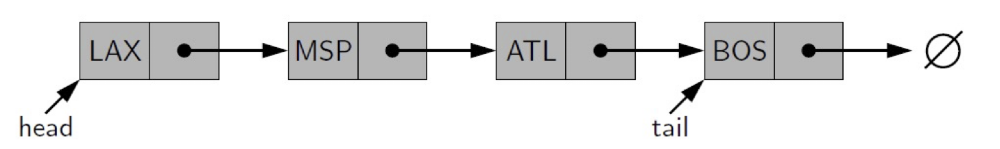

Inserting/removing a node in the `head` is `O(1)`; removing at the `tail` is `O(n)`, because we need to traverse until the predecessor of the `tail`!


Implementation:

```python
class Node:
    def __init__(self,value):
        self.value = value
        self.nextnode = None # tail, default

a = Node(1)
b = Node(2)
c = Node(3)

a.nextnode = b
b.nextnode = c
```

### Doubly Linked Lists

- A doubly linked list is like a singly linked list, but each node has two references instead of one; so altogether, we have:
  - The value or a reference to an object.
  - A reference to the previous node.
  - A reference to the next node.
- As with singly lists, we have:
  - A `head`, aka. `header`
  - A `tail`, aka. `trailer`
  - Both are also called *sentinels*.
- Thus, we have `O(1)` insertion/deletion at `head`/`tail`.
- Access to the element `k` is still `O(k)` (we can traverse the list from the head or the tail), but insertion/deletion once we found it is `O(1)`.

Example of how insertion works in a doubly linked list:

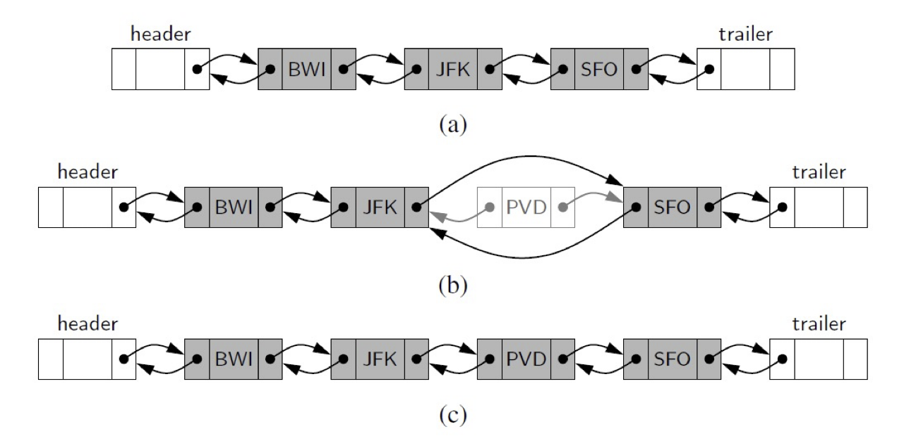

Implementation:

```python
class DoublyLinkedListNode(object):
    def __init__(self,value):
        self.value = value
        self.next_node = None
        self.prev_node = None

a = DoublyLinkedListNode(1)
b = DoublyLinkedListNode(2)
c = DoublyLinkedListNode(3)

# Setting b after a
b.prev_node = a
a.next_node = b

# Setting c after a
b.next_node = c
c.prev_node = b
```

### List Exercises

- [`Singly Linked List Cycle Check - SOLUTION.ipynb`](./Linked%20Lists/Linked%20Lists%20Interview%20Problems/Singly%20Linked%20List%20Cycle%20Check%20-%20SOLUTION.ipynb)
  - Problem: Given a singly linked list, write a function which takes in the first node in a singly linked list and returns a boolean indicating if the linked list contains a "cycle". A cycle is when a node's next point actually points back to a previous node in the list. This is also sometimes known as a circularly linked list.
  - Solution: we implement two traverses simultaneously, one advances one node at each step (slow) the other two (fast); if there is a cycle, there is no tail, so the traverse never stops and eventually both traverses will meet.
- [`Linked List Reversal - SOLUTION.ipynb`](./Linked%20Lists/Linked%20Lists%20Interview%20Problems/Linked%20List%20Reversal%20-%20SOLUTION.ipynb)
  - Problem: Write a function to reverse a Linked List in place.
  - Solution: We traverse the list node by node and change the pointers to go in opposite directions.
- [`Linked List Nth to Last Node - SOLUTION.ipynb`](./Linked%20Lists/Linked%20Lists%20Interview%20Problems/Linked%20List%20Nth%20to%20Last%20Node%20-%20SOLUTION.ipynb)
  - Problem: Write a function that takes a head node and an integer value n and then returns the n-th to last node in the linked list.
  - Solution: We use two iterators/traverses; we advance the first iterator n steps, then we advance the first and second iterator together until the first reaches the end - the second iterator must be n steps away from the tail now. 
- [`Implement a Linked List - SOLUTION.ipynb`](./Linked%20Lists/Linked%20Lists%20Interview%20Problems/Implement%20a%20Linked%20List%20-SOLUTION.ipynb)
  - Problem: Implement a singly linked list and a doubly linked list; often, in interviews, we're not given their implementation.
  - Solution: The implementation is in the above sections.

## 5. Recursion

### Recursion Basics

- Recursion: when a function calls itself; it's a ways of avoiding loops.
- We distinguish:
  - The base case: when the recursion stops; when recursive cases don't work we use it.
  - Recursive cases: when the function is called again.

Example: Factorial of an integer:

```python
def factorial(n):
  if n < 2: # base case, n = 0; in this case, also 1 and for checks negative numbers
    return 1
  else: # recursive cases
    return n*factorial(n)
```

More examples in [`Recursion Homework Example Problems - SOLUTIONS.ipynb`](./Recursion/Recursion%20Homework%20Example%20Problems%20-%20SOLUTIONS.ipynb):

- Write a recursive function which takes an integer and computes the cumulative sum of 0 to that integer.
- Given an integer, create a function which returns the sum of all the individual digits in that integer.
- Split a stream of strings in words defined in a dictionary, if possible.

### Memoization and Dynamic Programming

[Memoization](https://en.wikipedia.org/wiki/Memoization) consists in caching/storing often *expensive* solutions to a problem and re-using them later. If we apply memoization to recursion, we're doing **dynamic programming**. Memoization & dynamic programming are very important because solutions to seemingly simple problems can explode in complexity; for instance, have a look at the 

Example of factorial function with memoization:

```python

def factorial(k):
    if k < 2: 
        return 1
    else: 
        return k * factorial(k-1)

# Function memoization
# Create cache for known results

factorial_memo = {}

def factorial(k):
    if k < 2: 
        return 1
    # Memoization consists in checking if we have computed the value
    # already; if so, we return it, if not, we compute it with
    # recursion as store it!
    if not k in factorial_memo:
        factorial_memo[k] = k * factorial(k-1)
    return factorial_memo[k]

# Note: we can also perform function memoization
# by defining inside the original function:
# - the dictionary
# - and a helper recursive function
# See Recursion Problem 4: Change-making problem
def factorial_1(k):

    def factorial_recursive(k):
        if k < 2: 
            return 1
        # Memoization consists in checking if we have computed the value
        # already; if so, we return it, if not, we compute it with
        # recursion as store it!
        if not k in factorial_memo:
            factorial_memo[k] = k * factorial_1(k-1)
        return factorial_memo[k]
  
    factorial_memo = {}

    return factorial_recursive(k)

# Class memoization
class Memoize:
    def __init__(self, f):
        self.f = f
        self.memo = {}
    def __call__(self, *args):
        # Memoization consists in checking if we have computed the value
        # already; if so, we return it, if not, we compute it with
        # recursion as store it!
        if not args in self.memo:
            self.memo[args] = self.f(*args)
        return self.memo[args]

factorial_2 = Memoize(factorial)

# 2.19 ms
%%timeit
factorial(20)

# 117 ns
%%timeit
factorial_1(20)

# 187 ns
%%timeit
factorial_2(20)
```

### Recursion Exercises

- [`Recursion Problem 1 - Reverse String - SOLUTION.ipynb`](./Recursion/Recursion%20Problems%20-%20%20SOLUTIONS/Recursion%20Problem%201%20-%20Reverse%20String%20-%20SOLUTION.ipynb)
  - Problem: Reverse a string with recursion.
  - Solution: Take last character and reverse rest recursively. Or, better, the other way around: take first character, call `reverse()` and return result with first character appended.
- [`Recursion Problem 2 - String Permutation- SOLUTION.ipynb`](./Recursion/Recursion%20Problems%20-%20%20SOLUTIONS/Recursion%20Problem%202%20-%20String%20Permutation-%20SOLUTION.ipynb)
  - Problem: Given a string, write a function that uses recursion to output a list of all the possible permutations of that string.
  - Solution: We traverse all letters in the string and permute the rest. The base case is one letter. Each permutation call returns the current letter and the permutation result concatenated. Note that a permutation is a factorial itself.
- [`Recursion Problem 3 - Fibonacci Sequence - SOLUTION.ipynb`](./Recursion/Recursion%20Problems%20-%20%20SOLUTIONS/Recursion%20Problem%203%20-%20Fibonacci%20Sequence%20-%20SOLUTION.ipynb)
  - Problem: Compute the Fibonacci sequence with recursion, dynamically (recursion + memoization) and iteratively.
  - Solution: Recursion is straightforward. The others are engineering:
    - Dynamic version: Memoization class is used directly.
    - Iterative version: Tuple unpacking can be used.
- [`Recursion Problem 4 - Coin Change - SOLUTION.ipynb`](./Recursion/Recursion%20Problems%20-%20%20SOLUTIONS/Recursion%20Problem%204%20-%20Coin%20Change%20-%20SOLUTION.ipynb)
  - Problem: Given a target amount n and a list (array) of distinct coin values, what's the fewest coins needed to make the change amount.
  - Solution: Have a look at the notebook. Basically, a dictionary is built to store previous values. Then, we build the base case and a recursion which stores previous values. The recursion considers all coins and the difference to the target of each coin. **This problem is very interesting; have a look at it!**
  - Very popular problem: [Change-making problem](https://en.wikipedia.org/wiki/Change-making_problem).

## 6. Trees

### Basics and Implementation

Some properties of trees:

- Trees have:
  - Root, branches & leaves.
  - Parent and children nodes; each child belongs to one parent.
- Each leaf node is unique.
- Each node can have
  - A name, also known as *key*.
  - A *value* or additional information, also known as *payload*; usually the payload is not used in the algorithms, but in practice it is what we're looking for.
- Edges are connections between parent-children nodes.
- The root node is the only node with no incomming edges.
- Leaf nodes have no children.
- We can create paths in trees when we traverse the nodes.
- There is a unique path from the root to a node.
- Nodes that share a parent are siblings.
- If each node has a maximum number of 2 children, we have a **binary tree**.
- **Level** of a node: number of edges on the path from the root to the node.
- **Height** of the tree: maximum level of an node in the tree.
- Trees can be defined recursively: a tree is a tree if it contains a root and optionally other subtrees. That definition is relevant, because it opens the door to recursive implementations.
- When processing trees, we can take entire branches (which are subtrees) and move them around; in fact, that's what is done when we add new nodes/branches in a given node level.

Example of a binary tree:

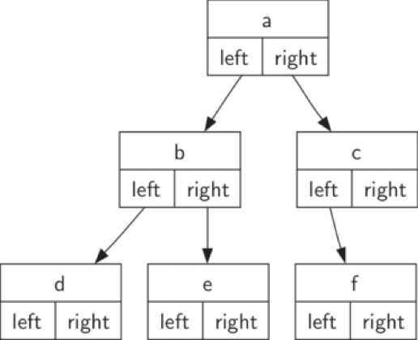

The simplest way (non-optimal) of implementing trees in python is using **lists of lists**:

- The first item is the root node, which contains its children nodes
- The second element is one subtree, i.e., a children *tree* of the root, which also contains its children nodes or *sub-trees*
- And so on...

```python
# This example is implemented with functions
# without OOP, but it could be implemented with classes
# as shown below

def BinaryTree(r):
    # first: root value
    # second: left subtree
    # third: right subtree
    # we could extend this structure to be a general (i.e., non-binary) tree
    return [r, [], []]

def insertLeft(root, newBranch):
    # We extract the element in position 1: left child
    t = root.pop(1)
    # If the left child is not empty,
    # insert it to the left of the new branch
    # else, insert a new barnch to the empty left child of root
    if len(t) > 1:
        root.insert(1, [newBranch, t, []])
    else:
        root.insert(1, [newBranch, [], []])
    return root

# Same as insertLeft, but with position 2 == right side
def insertRight(root,newBranch):
    t = root.pop(2)
    if len(t) > 1:
        # Insert existing prior child to the right == position 2
        root.insert(2, [newBranch, [], t])
    else:
        root.insert(2, [newBranch, [], []])
    return root

def getRootVal(root):
    return root[0]

def setRootVal(root, newVal):
    root[0] = newVal

def getLeftChild(root):
    return root[1]

def getRightChild(root):
    return root[2]

###

r = BinaryTree(3) #  [3, [], []]
insertLeft(r,4) # [3, [4, [], []], []]
insertLeft(r,5) # [3, [5, [4, [], []], []], []]
insertRight(r,6) # [3, [5, [4, [], []], []], [6, [], []]]
insertRight(r,7) # [3, [5, [4, [], []], []], [7, [], [6, [], []]]]
l = getLeftChild(r)
print(l) # [5, [4, [], []], []]
setRootVal(l,9)
print(r) # [3, [9, [4, [], []], []], [7, [], [6, [], []]]]
```

Another (more sophisticated) way of implementing a tree in python is using **Object-Oriented Programming (OOP) with nodes and references**:

```python
class BinaryTree(object):
    def __init__(self, rootObj):
        # The root expects a value to be stored
        # Here we use the attribute key, but I think
        # it would have been better to name it value/payload
        self.key = rootObj
        self.leftChild = None
        self.rightChild = None

    def insertLeft(self, newNode):
        # If we have no left child, create new and add newNode
        # to root; else, create new node, add to its left the current
        # left child and assign to the left child the newly create node
        # This approach is the same as with lists, but using classes,
        # nodes and references, instead
        if self.leftChild == None:
            self.leftChild = BinaryTree(newNode)
        else:
            # create a new node
            t = BinaryTree(newNode)
            # push to the left of the new node the current left node
            t.leftChild = self.leftChild
            # the current left node is assigned the new node!
            self.leftChild = t

    # Same as insertLeft but for the right side
    def insertRight(self, newNode):
        if self.rightChild == None:
            self.rightChild = BinaryTree(newNode)
        else:
            t = BinaryTree(newNode)
            t.rightChild = self.rightChild
            self.rightChild = t

    def getRightChild(self):
        return self.rightChild

    def getLeftChild(self):
        return self.leftChild

    def setRootVal(self, obj):
        self.key = obj

    def getRootVal(self):
        return self.key

###

r = BinaryTree('a')
print(r.getRootVal()) # a
print(r.getLeftChild()) # None
r.insertLeft('b')
print(r.getLeftChild()) # <__main__.BinaryTree object at 0x7faa19fce750>
print(r.getLeftChild().getRootVal()) # b
r.insertRight('c')
print(r.getRightChild()) # <__main__.BinaryTree object at 0x7fa9f06f2050>
print(r.getRightChild().getRootVal()) # c
r.getRightChild().setRootVal('hello')
print(r.getRightChild().getRootVal()) # hello

```

### Traversals

There are 3 basic tree traversal operations, depending on when we visit the root node:

- Preorder
  1. First, visit **root** node.
  2. Then, a recursive preorder traversal of **left** sub-tree.
  3. Finally, recursive preorder traversal of the **right** sub-tree.
- Inorder
  1. First, a recursive inorder traversal of **left** sub-tree.
  2. Then, visit **root** node.
  3. Finally, recursive inorder traversal of the **right** sub-tree.
- Postorder
  1. First, a recursive postorder traversal of **left** sub-tree.
  2. Then, recursive postorder traversal of the **right** sub-tree.
  3. Finally, visit **root** node.

Given the following book section tree, we would read the contents in the following order with each approach:

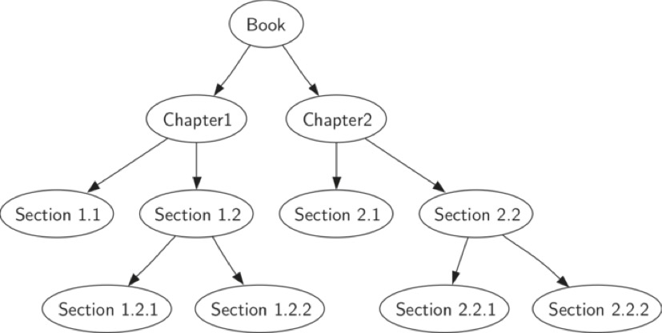

- Preorder: all sections and their text in the natural order: Book, Ch 1, S 1.1, S 1.2, S 1.2.1, S 1.2.2, ...
- Inorder: we go as deep as possible first: S 1.1, Ch 1, S 1.2.1, S 1.2, ...
- Postorder: we visit the leaves first!

We can implement the traversals in the class or outside; sometimes it's preferable to implement them outside, because traversing is not necessarily a function of the tree, but a method applied on it:

```python
def preorder(tree):
    if tree:
        print(tree.getRootVal())
        preorder(tree.getLeftChild())
        preorder(tree.getRightChild())

def inorder(tree):
    if tree:
        inorder(tree.getLeftChild())
        print(tree.getRootVal())
        inorder(tree.getRightChild())

def postorder(tree):
    if tree:
        postorder(tree.getLeftChild())
        postorder(tree.getRightChild())
        print(tree.getRootVal())

# If inside the class...
def preorder(self)
    print(self.key)
    if self.leftChild:
        self.leftChild.preorder()
    if self.rightChild:
        self.rightChild.preorder()
```

### Priority Queues with Binary Heaps

A priority queue is a queue, but its elements are ordered according to their relevance or priority, not their order of insertion. We can:

- Dequeue elements from the front, being the front item the most important one. The ones at the back have less priority.
- Enqueue elements: they are inserted in the position determined by their relevance.

A typical application is to order items in such a way that the minimum/maximum value is always at the front.

The classical way to implement a priority queue is a [**binary heap**](https://en.wikipedia.org/wiki/Binary_heap), which allows to enqueue/dequeue items with `O(logn)`! Following the application of keeping the min/max value at the front, we have two variations for binary heaps:

- Min heaps
- Max heaps

Some interesting additional material:

- The Wikipedia article on [**binary heaps**](https://en.wikipedia.org/wiki/Binary_heap)
- [`02_Ordered_DS`](https://github.com/mxagar/accelerated_computer_science_coursera/tree/main/02_Ordered_DS) from the Accelerated Computer Science Structures Specialization.

Altogether, the following sections/operations are covered here:

- [Tree structure and node localization](#tree-structure-and-node-localization)
- [Insertion of nodes](#insertion-of-nodes)
- [Delete minimum value](#delete-minimum-value)
- [Create heap from a list](#create-heap-from-a-list)
- [Final class with all the algorithms](#final-class-with-all-the-algorithms)

#### Tree structure and node localization

- We will work with binary trees which are **complete**, i.e.:
  - Perfect until the last level: all nodes filled in
  - In the last level, all the nodes pushed to the left
- In that case, the binary tree can be represented in an array (reserving the first element), and given the position `p` of a node, the position of its children is given by `2*p + c`, `c = 0` for the left child, `c = 1` for the right. Similarly, the parent of a node in position `p` will be `p//2`.
- Note that the first item in the list is not used so that the children-parent localization works as explained.

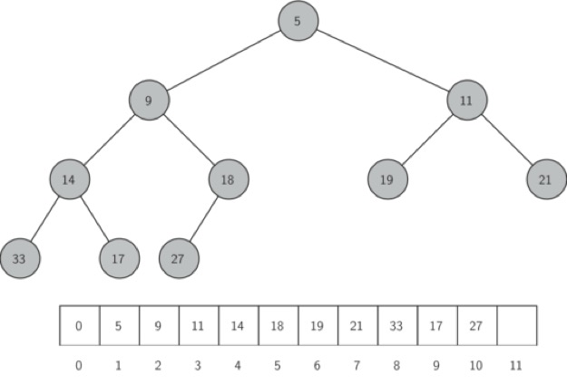

#### Insertion of nodes

Appending to the end of the list to insert a node is compliant with the tree structure, **BUT** it violates the heap structure property. To solve that, we can re-gain the heap structure simply by swaping items! That's implemented in the function `percUp()`: it swaps the current node with its parent if the parent has a larger value (in the case of a min heap). The action is called *percolation* or *heapifying up*.

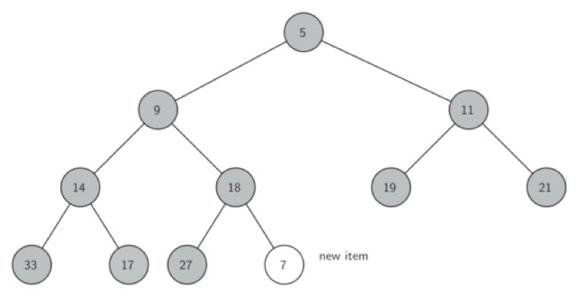

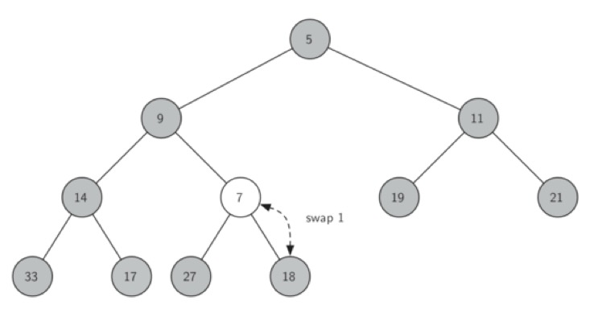

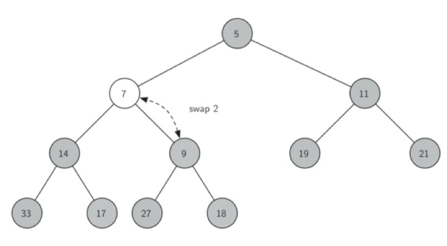

#### Delete minimum value

Detecting the minimum value in a min heap is very easy: it's always going to be the root! However, popping it complicates the situation: we need to percolate down or swap nodes so that the heap structure is not violated.

The following steps are followed:

- We remove the root node, which contains the minimum element in the min heap.
- We replace the empty root with the last item in the heap list.
- We percolate down the new root: we check its children (left/right) and swap it with the smallest one; the process continues until the children beneath are larger.

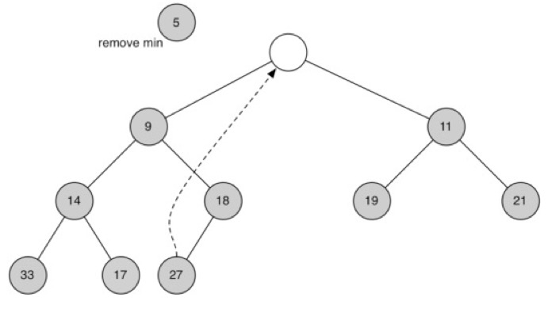

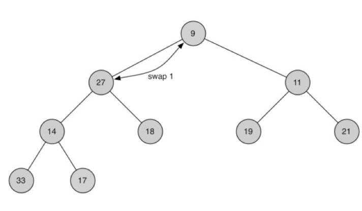

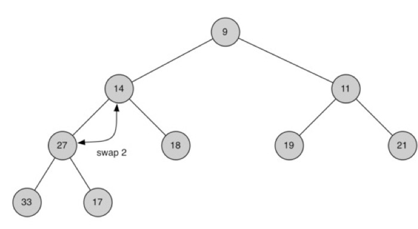

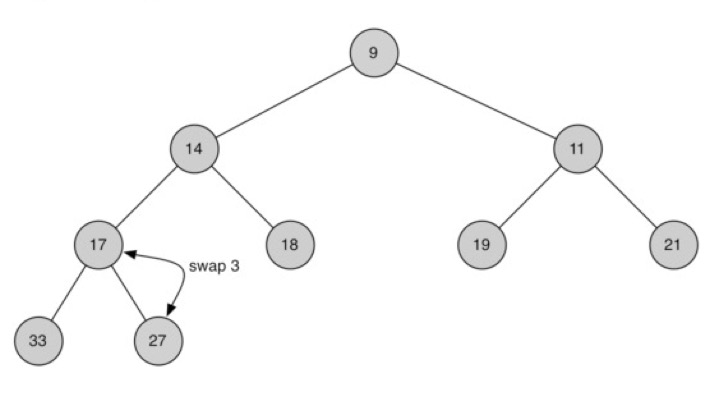

#### Create a heap from a list

We could create a heap from a list by inserting the items one by one. However, a more efficient way, `O(n)`, is the following:

- We assign the unordered list to the heap list.
- Then, we start percolating down all the nodes in the heap/tree except the leaves; recall that each level, we double the nodes in a binary tree as a heap - thus, num_nodes//2 equals all nodes except the leaves. This works in `O(n)`.

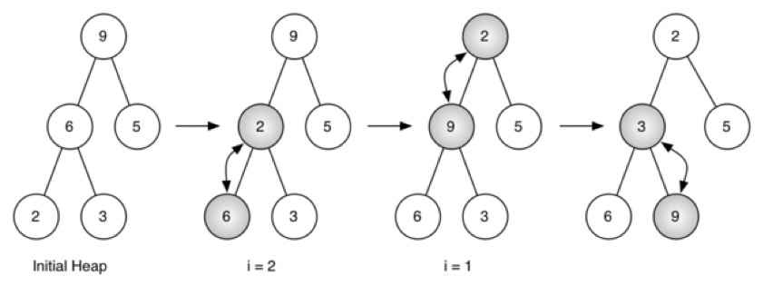

#### Final class with all the algorithms

```python
# Note: This is the implmentation of the Min Heap
# The children nodes have always a smaller value than their parents.
# The root node contains the smallest value in the tree.

class BinHeap:
    def __init__(self):
        # The first 0 element of the heap is not used
        # it's there for convenience in the tree node locailzation
        self.heapList = [0]
        self.currentSize = 0

    def percUp(self,i):
        # percUp() swaps the current node with its parent
        # if the parent has a larger value. That ensures
        # that the inserted node doesn't break the heap
        # structure in the array; i.e., to insert a node,
        # we simply append it to the end and then
        # apply percUp until the parent of the node is smaller.
        while i // 2 > 0:
            if self.heapList[i] < self.heapList[i // 2]:
                tmp = self.heapList[i // 2]
                self.heapList[i // 2] = self.heapList[i]
                self.heapList[i] = tmp
            i = i // 2

    def insert(self,k):
        # Appending to the end of the list to insert a node
        # is compliant with the tree structure, BUT
        # it violates the heap structure property.
        # To solve that, we can re-gain the heap structure
        # simply by swaping items! That's percUp()
        # percUp() swaps the current node with its parent
        # if the parent has a larger value.
        self.heapList.append(k)
        self.currentSize = self.currentSize + 1
        self.percUp(self.currentSize)

    def percDown(self,i):
        # We have removed the root node and replaced it with
        # the last node; now, we need to fix the heap structure
        # by percolating down the swaped node.
        # Basically, the new root is swaped with the smallest child
        # beneath until there's no smaller child.
        while (i * 2) <= self.currentSize:
            # Select smallest child: left or right?
            mc = self.minChild(i)
            # If current node is larger than the smallest child
            # SWAP both!
            if self.heapList[i] > self.heapList[mc]:
                tmp = self.heapList[i]
                self.heapList[i] = self.heapList[mc]
                self.heapList[mc] = tmp
            i = mc

    def minChild(self,i):
        # Select the smallest child of node i: left or right?
        if i * 2 + 1 > self.currentSize:
            return i * 2
        else:
            if self.heapList[i*2] < self.heapList[i*2+1]:
                return i * 2
            else:
                return i * 2 + 1

    def delMin(self):
        # We remove the root node, which contains the
        # minimum element in the min heap.
        # To ensure the heap structure, we need to
        # swap the nodes with percDown()
        retval = self.heapList[1] # root node
        # Swap last node to root position
        self.heapList[1] = self.heapList[self.currentSize]
        # Update size
        self.currentSize = self.currentSize - 1
        # Remove last node, because we moved it to the root
        self.heapList.pop()
        # Percolate down the new root node
        self.percDown(1)
        return retval

    def buildHeap(self,alist):
        # We assign the unordered list to the heap list
        # Then, we start percolating down all the nodes in the heap/tree
        # except the leaves; recall that each level, we double the nodes
        # in a binary tree as a heap - thus, num_nodes//2 equals all nodes
        # except the leaves.
        # This works in O(n)
        i = len(alist) // 2
        self.currentSize = len(alist)
        self.heapList = [0] + alist[:]
        while (i > 0):
            self.percDown(i)
            # Percolate all nodes up in the tree
            # Go up in the tree, that way we know that wan't below
            # has already been fixed.
            i = i - 1
```

### Binary Search Trees (BST)

Key-value mappings can be achieved in two major ways:

- Hash tables: dictionaries.
- Binary search trees.

Binary search trees are defined with the **BST property**: keys that are less than the parent are found in the left subtree and key that are larger than the parent are found in the right subtree.

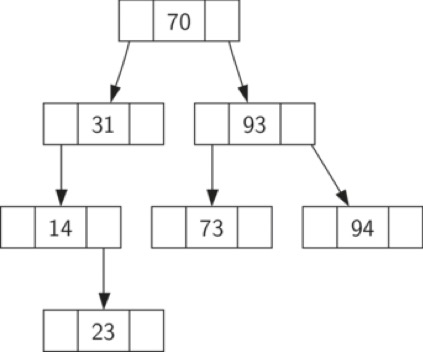

To implement a tree, two classes are defined:

- `TreeNode`
- `BinarySearchTree`

In the following, the most important operations are explained, followed by the code that implements the binary search tree:

- [Insert a node](#insert-a-node)
- [Retrieve a value](#retrieve-a-value)
- [Delete a node](#delete-a-node)
- [BST implementation code](#bst-implementation-code)

#### Insert a node

To **insert** a node with the key-value pair, we call a `put()` method, which inserts the node in its correct place by recursively calling itself and checking the left and right node keys. Note that the implementation shown below has an issue with duplicate keys: it is commented in the code.

Example of inserting a node with key 19:

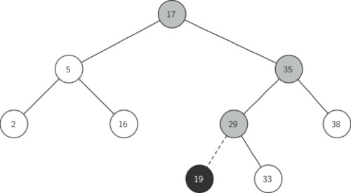

#### Retrieve a value

To **retrieve the value of a node given its key**, we call the `get()` method, which searches recursively a given key until it is found of we end up in a leaf without having found the key. The method is easier than `put()` and it also uses a private recursive call.

#### Delete a node

Key deletion is the most challenging operation in BSTs.

Steps:

- First, find the node to delete by searching its key: `_get()`; the key can be:
  - not found: error
  - the root itself
  - another node
- Second, if the node is found, we call the function `remove()`.

The function `remove()` distinguishes 3 cases:

1. Case 1: The node to be deleted has no children, i.e., it's a leaf. In that case, we just delete the node by removing its reference in its parent.
2. Case 2: The node to be deleted has only one child. In that case, we promote the child to take the place of its removed parent, i.e., we replace the node with its child. The replacement needs to take into account whether the node is left/right/root and whether its child is left/right to set the references correctly.
3. Case 3: The node to be deleted has two children; it's the most general and difficult case. It works in two steps:
   - We find its successor: that's the node with the next largest key in the tree. The successor is found with `findSuccessor()` and `findMin()`.
   - We remove the successor with `spliceOut()`.
   - We replace the current deleted node with the successor key-value pair.

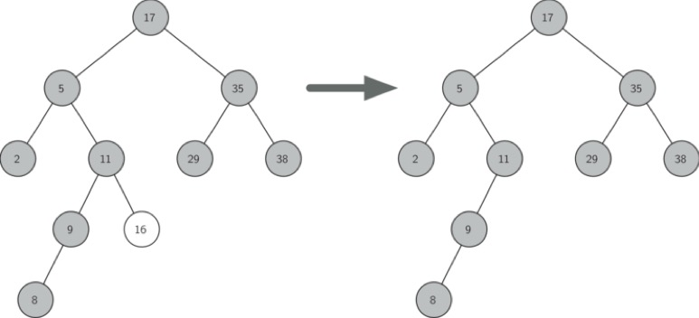

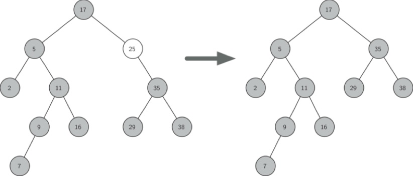

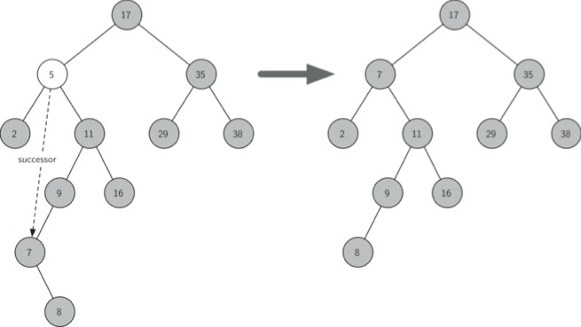

#### BST implementation code

All the previous sections are implemented here in addition to the special methods `__setitem__`, `__getitem__`, `__delitem__`, `__iter__`, etc.

```python
# Basic node class
# which contains the key-value pair
# as well as references to 
# left child, right child, parent
class TreeNode:
    def __init__(self, key, val, left=None, right=None, parent=None):
        self.key = key
        self.payload = val
        self.leftChild = left
        self.rightChild = right
        self.parent = parent

    def hasLeftChild(self):
        return self.leftChild

    def hasRightChild(self):
        return self.rightChild

    def isLeftChild(self):
        return self.parent and self.parent.leftChild == self

    def isRightChild(self):
        return self.parent and self.parent.rightChild == self

    def isRoot(self):
        return not self.parent

    def isLeaf(self):
        return not (self.rightChild or self.leftChild)

    def hasAnyChildren(self):
        return self.rightChild or self.leftChild

    def hasBothChildren(self):
        return self.rightChild and self.leftChild

    def replaceNodeData(self, key, value, lc, rc):
        self.key = key
        self.payload = value
        self.leftChild = lc
        self.rightChild = rc
        if self.hasLeftChild():
            self.leftChild.parent = self
        if self.hasRightChild():
            self.rightChild.parent = self

    def __iter__(self):
        # Inorder iterator/traverse
        # yield returns a value and freezes the function 
        # so the next time it is called
        # it goes to the point it exited.
        # This code is recursive!
        # That's because its a generator in a loop
        # which calls the children of a tree every time.
        if self:
            if self.hasLeftChild():
                for elem in self.leftChild: # we're using the generator!
                    yield elem # this is a key!
            yield self.key # base case, recursion ends
            if self.hasRightChild():
                for elem in self.rightChild:
                    yield elem


class BinarySearchTree:
    def __init__(self):
        self.root = None
        self.size = 0

    def length(self):
        return self.size

    def __len__(self):
        # len(BinarySearchTree)
        return self.size

    def put(self, key, val):
        # Initial check + call private _put
        if self.root:
            self._put(key, val, self.root)
        else:
            self.root = TreeNode(key, val)
        self.size = self.size + 1

    def _put(self, key, val, currentNode):
        # Actual (private) put method that
        # 1) Checks whether the key is larger (right) / smaller (left) than the current node
        # 2) Recursively calls put() to insert the key-value pair in the correct place
        # HOWEVER: This method has an issue: it doesn't check
        # for duplicate keys, i.e., duplicates are inserted as the right child
        # so they are pushed down and never found, because the first one will be found first.
        # A solution is to REPLACE a node with a duplicate key.
        # To that end, I understand that we should add a 3rd new case in this if
        # and use replaceNodeData() in the case key == currentNode.key.
        if key < currentNode.key:
            # the key to be inserted is not smaller than the
            # search node we're in, thus, it should be put
            # on its left (BST property)
            if currentNode.hasLeftChild():
                # if there is a left child,
                # we need to use the put() method to push the correct node
                # downwards
                self._put(key, val, currentNode.leftChild)
            else:
                # if there's no left child, we create one
                currentNode.leftChild = TreeNode(key,
                                                 val,
                                                 parent=currentNode)
        else:
            # the key to be inserted is not smaller than the
            # search node we're in, thus, it should be put
            # on its right (BST property)
            if currentNode.hasRightChild():
                # if there is a right child,
                # we need to use the put() method to push the correct node
                # downwards
                self._put(key, val, currentNode.rightChild)
            else:
                # if there's no right child, we create one
                currentNode.rightChild = TreeNode(key,
                                                  val,
                                                  parent=currentNode)

    def __setitem__(self, k, v):
        # BinarySearchTree[k] = v
        self.put(k, v)

    def get(self, key):
        # Search for the key in the tree
        # and return its value if found.
        # The private _get() method is used recursively.
        if self.root:
            res = self._get(key, self.root)
            # If something not None found, return it
            if res:
                return res.payload
            else:
                return None
        else:
            return None

    def _get(self, key, currentNode):
        # If currentNode is None, return None
        if not currentNode:
            return None
        # If key found, return nodes's value/payload
        # Recursion ends here
        elif currentNode.key == key:
            return currentNode
        # If key is smaller than current node -> go to left (+ recursion)
        elif key < currentNode.key:
            return self._get(key,currentNode.leftChild)
        # If key is smaller than current node -> go to right (+ recursion)
        else:
            return self._get(key,currentNode.rightChild)

    def __getitem__(self, key):
        # v = BinarySearchTree[k]
        return self.get(key)

    def __contains__(self, key):
        # k in BinarySearchTree
        if self._get(key, self.root):
            return True
        else:
            return False

    def delete(self, key):
        if self.size > 1:
            nodeToRemove = self._get(key, self.root)
            if nodeToRemove:
                self.remove(nodeToRemove)
                self.size = self.size - 1
            else:
                raise KeyError('Error, key not in tree')
        elif self.size == 1 and self.root.key == key:
            self.root = None
            self.size = self.size - 1
        else:
            raise KeyError('Error, key not in tree')

    def __delitem__(self, key):
        # del BinarySearchTree[k]
        self.delete(key)

    def spliceOut(self):
        if self.isLeaf():
            if self.isLeftChild():
                self.parent.leftChild = None
            else:
                self.parent.rightChild = None
        elif self.hasAnyChildren():
            if self.hasLeftChild():
                if self.isLeftChild():
                    self.parent.leftChild = self.leftChild
                else:
                    self.parent.rightChild = self.leftChild
                    self.leftChild.parent = self.parent
        else:
            if self.isLeftChild():           
                self.parent.leftChild = self.rightChild
            else:
                self.parent.rightChild = self.rightChild
                self.rightChild.parent = self.parent

    def findSuccessor(self):
        # The successor is the next largest key in the tree
        succ = None
        if self.hasRightChild():
            # If the node has a right child, the next largest key
            # must be the minimum key down the right branch,
            # the leftmost key in the right branch.
            succ = self.rightChild.findMin()
        else:
            if self.parent: # not root, else None returned
                if self.isLeftChild():
                    succ = self.parent
                else:
                    self.parent.rightChild = None
                    succ = self.parent.findSuccessor()
                    self.parent.rightChild = self
        return succ

    def findMin(self):
        # The minimum value will be always to the left!
        # We keep going left until there no left child
        # Thus, the minimum value is the left-most leaf
        current = self
        while current.hasLeftChild():
            current = current.leftChild
        return current

    def remove(self, currentNode):
        if currentNode.isLeaf(): # Leaf: remove reference to in in parent
            if currentNode == currentNode.parent.leftChild:
                currentNode.parent.leftChild = None
            else:
                currentNode.parent.rightChild = None
        elif currentNode.hasBothChildren(): # Interior, 2 children
            succ = currentNode.findSuccessor()
            succ.spliceOut() # remove successor from tree
            # Replace removed node (current) with successor's key-value pair
            currentNode.key = succ.key
            currentNode.payload = succ.payload
        else: # This node has one child
            # We promote the child to take the place
            # of its removed parent; i.e., we replace the node
            # with its child. The replacement needs to take into account
            # whether the node is left/right/root
            # and whether its child is left/right
            # to set the references correctly.
            if currentNode.hasLeftChild():
                if currentNode.isLeftChild():
                    currentNode.leftChild.parent = currentNode.parent
                    currentNode.parent.leftChild = currentNode.leftChild
                elif currentNode.isRightChild():
                    currentNode.leftChild.parent = currentNode.parent
                    currentNode.parent.rightChild = currentNode.leftChild
                else: # root
                    currentNode.replaceNodeData(currentNode.leftChild.key,
                                    currentNode.leftChild.payload,
                                    currentNode.leftChild.leftChild,
                                    currentNode.leftChild.rightChild)
            else:
                if currentNode.isLeftChild():
                    currentNode.rightChild.parent = currentNode.parent
                    currentNode.parent.leftChild = currentNode.rightChild
                elif currentNode.isRightChild():
                    currentNode.rightChild.parent = currentNode.parent
                    currentNode.parent.rightChild = currentNode.rightChild
                else:
                    currentNode.replaceNodeData(currentNode.rightChild.key,
                                    currentNode.rightChild.payload,
                                    currentNode.rightChild.leftChild,
                                    currentNode.rightChild.rightChild)
```

### Tree Exercises

Recall that a tree can be simply implemented with a `Node` class:

```python
class Node:
    def __init__(self, key, value, left=None, right=None):
        self.key = key
        self.value = value
        self.left = left
        self.right = right
```

- [`Binary Search Tree Check - SOLUTION.ipynb`](./Trees/Trees%20Interview%20Problems%20-%20SOLUTIONS/Binary%20Search%20Tree%20Check%20-%20SOLUTION.ipynb):
  - Problem: Check if a tree is a Binary Search Tree (BST).
  - Solution: BST property is checked: given a node, its value must be between the values of the left and right children. The property is checked with recursive calls given a node.
- [`Tree Level Order Print - SOLUTION.ipynb`](./Trees/Trees%20Interview%20Problems%20-%20SOLUTIONS/Tree%20Level%20Order%20Print%20-%20SOLUTION.ipynb)
  - Problem: Given a binary tree of integers, print it in level order. The output will contain space between the numbers in the same level, and new line between different levels.
  - Solution: a FIFO queue (a list, basically) is filled with root node; then, we perform `pop(0)` from it, print the node's key and and `append()` its children in a while loo
- [`Trim a Binary Search Tree - SOLUTION.ipynb`](./Trees/Trees%20Interview%20Problems%20-%20SOLUTIONS/Trim%20a%20Binary%20Search%20Tree%20-%20SOLUTION.ipynb)
  - Problem: Given the root of a binary search tree and 2 numbers min and max, trim the tree such that all the numbers in the new tree are between min and max (inclusive). The resulting tree should still be a valid binary search tree.
  - Solution


## 7. Searching and Sorting

## 8. Graph Algorithms

## 9. Riddles

## 10. Python Tips & Tricks

### Interesting Articles, Links

- [12 Python Features Every Data Scientist Should Know](https://medium.com/bitgrit-data-science-publication/12-python-features-every-data-scientist-should-know-1d233dbaab0c)

### Python Tools

```python
###
# General
###

# Time execution time with several loops
%%timeit
foo()

# Maximum possible value
float("inf")

# is and is not check whether two variables refer to the same object in memory
a = [1, 2, 3]
b = a.copy()
b != a # False: values compared
b is not a # True: memory address compared

# Divisions and modulo
5//2 # 2
5%2 # 1

# Lambda functions
def square(x):
    return x**2
# Lambda equivalent; use-once functions
s = lambda x: x**2
# See also map() and filter()

# Get a variable name as a string
def get_variable_name(variable):
    globals_dict = globals()
    if variable:
        return [var_name for var_name in globals_dict 
                    if globals_dict[var_name] is variable][0]
    else:
        return None

# Get a variable memory address
a = [1, 2, 3, 4, 5]
print(id(a)) # 140234866534752
a = 12
print(id(a)) # 94264748411744

# Casting
str(1) # "1"
int(1.01) # 1
float(1) # 1.0

# Non-booleans evaluate as True
# if they're not None or 0
# This is relevant for if/while/assert
a = -1
b = 0.0
c = None
d = [1, 2]
e = [0, 0]
if a:
  return True # True
assert b # False, Error
assert c # False, Error
assert d # True
assert e # True

# Unpacking iterables as arguments
# *args means "treat the elements of this iterable as positional arguments to this function call."
# **kwargs means "treat the key-value pairs in the dictionary as additional named arguments to this function call."

def foo(x, y):
    print(x, y)

t = (1, 2)
foo(*t) # 1 2

[1, *(2, 3), 4] # [1, 2, 3, 4]

d = {'x':1, 'y':2}
foo(**d) # 1 2

###
# Arrays / Lists, Strings, Dictionaries, Sets & Co.
###

# Last element
a[-1]

# Reverse
a[::-1]
# Equivalent
reversed(a)

# Slicing lets out of range indices!
a = [1,2,3]
a[3] # Out of index ERROR
a[5:] # [], NO ERROR!
text = 'abc'
text[5:] # '', NO ERROR!

# Sort
sorted(a)
a.sort() # in place

# More on Slicing
l = [1, 2, 3, 4, 5]
l1 = l[0:2] # [1, 2, 3]
l2 = l[2:4] # [4, 5]
l3 = l1 + l2 # [1, 2, 3, 4, 5]

# Dictionaries
d = {}
d['key'] = 'value'
for k in d.keys():
    pass
# To .extend() a dictionary
a.update(b) # dictionary a gets k:v from b and we get None in return
# Also with dictionaries
for k, v in d.items():
    pass

# List/Dictionary comprehensions & enumerate
[v for v in range(10) if v%2 == 0] # [0, 2, 4, 6, 8]
{k:v for k,v in enumerate(range(0,10,2))} # {0: 0, 1: 2, 2: 4, 3: 6, 4: 8}

# Conditional loops
for i in [n for n in numbers if n%2 ==0]:
    pass
# ... prefer them to for+if 
for i in numbers:
    if i%2 == 0:
        pass

# Initialize, append, pop
a = []
a.append(1) # [1]
a.extend([2, 3]) # [1, 2, 3]
a.append([4, 5]) # [1, 2, 3, [4, 5]]
b = a.pop() # a = [1, 2, 3], b = [4, 5]
c = a.pop(0) # a = [2, 3], c = 1

# Sets: nice way of reducing time complexity!
s = set()
s.add(obj) # can be an int, tuple, etc.
if e in s:
    print(f"{e} is in set s")

# sum(), max(), min()
a = [1,2,3]
s = sum(a) # 6
max_ = max(a) # 3
min_ = max(a) # 1

# zip()
arr1 = [1, 2, 3]
arr1 = [4, 5, 6]
for p in zip(arr1,arr2):
    print(p) # (1, 4), (2, 5), (3, 6)
    # unpacking
    a, b = p

# map(), filter(), all()
# map(function, iterable): apply function() all items from iterable and return new iterable
# filter(function->Bool, iterable)
# all(iterable)
list(map(lambda x: x**2, [1, 2, 3])) # [1, 4, 9]
list(filter(lambda x: x%2 == 0, [1, 2, 3])) # [2]
all(map(lambda x: x%2 == 0, [1, 2, 3])) # False

# Tuple unpacking
a, b = my_tuple
# Note there is an order!
# First right side is evaluated
# then left side is assigned the right side
a, b = b, a + b
# Equivalent to
a_new = b
b_new = a + b
a = a_new
b = b_new
# Variable swap, without temp
x, y = y, x

# Collections: Counter, OrderedDict, defaultdict, namedtuple(), ...
# https://docs.python.org/3/library/collections.html
# Counter: 
c = Counter()                           # a new, empty counter
c = Counter('gallahad')                 # a new counter from an iterable
c = Counter({'red': 4, 'blue': 2})      # a new counter from a mapping
c = Counter(cats=4, dogs=8)             # a new counter from keyword args
c = Counter(['eggs', 'ham'])
c['bacon']                              # 0, there is no such key
c['sausage'] = 0                        # counter entry with a zero count
del c['sausage']                        # del actually removes the entry
Counter('abracadabra').most_common(3)   # [('a', 5), ('b', 2), ('r', 2)]
# defaultdict: if no key, it initializes it
import collections
d = collections.defaultdict(int)
d[1] += 1 # even though d[1] was not created explicitly, it's initialized
# Deque: double ended queue, can be used as stack/queue
# pop & append work on the right; for the left, we have:
from collections import deque
numbers = deque([1, 2, 3, 4])
numbers.popleft() # 1
numbers.appendleft(10) # [10, 2, 3, 4]

# String handling basics
# Reverse a text
s = "Hello world"
s.split() # ["Hello", "world"]
" ".join(s[::-1]) # "world Hello"
# Remove spaces and lowercase letters
s1 = s1.replace(' ','').lower()
s2 = s2.replace(' ','').lower()
# Prefixes & suffixes
s.startswith('01_')
s.endswith('exe')

```

### Testing

```python

# Function to be tested
def square(n):
    return n*n

# Unit test class
class UnitTest:
    
    def test(self, foo):
        assert (foo(2) == 4)
        assert (foo(-2) == 4)
        assert (foo(0) == 0)
        assert not (foo(3) == 10)
        print('All test cases passed')
        
# Run Tests
t = UnitTest()
t.test(square)

```

### Tricks

```python
## Get code of a function/class
import inspect

# Previously defined, somewhere...
class MyClass:
    def my_method(self):
        print("Hello, world!")

# In some other part of the code:
source_code = inspect.getsource(MyClass)
print(source_code)
```

## 11. Other Topics

### Salary Negotiation

- Wait the topic to be raised.
- Know your value and prove a range based off a minimum.
- Check company salaries: [https://www.glassdoor.com](https://www.glassdoor.com).
- It is often said the it's better to let the company to make the first move. Whatever.
- Interesting lecture: [How to Negotiate Your Job Offer - Prof. Deepak Malhotra (Harvard Business School)](https://www.youtube.com/watch?v=km2Hd_xgo9Q)

### Job Search Platforms

Job postings:

- [https://angel.co](https://angel.co)
- [http://www.simplyhired.com](http://www.simplyhired.com)
- [https://www.glassdoor.com](https://www.glassdoor.com)
- [https://www.linkedin.com/](https://www.linkedin.com/)
- [http://www.indeed.com/](http://www.indeed.com/)

Matching:

- [https://hired.com/](https://hired.com/)
- [https://www.whitetruffle.com/](https://www.whitetruffle.com/)
- [http://www.indeed.com](http://www.indeed.com)
- [https://otta.com/](https://otta.com/)

### Typical Behavioral Questions

- Tell me about yourself
  - Brief history + accomplishments
- Why are you leaving your current position
  - Be positive, show what we want
  - Emphasize departure will be professional
  - Ambition, goals, growing, responsibilities
- Why do you want this position?
  - Show passion.
  - Confidence.
- Where do you see yourself in 5 years?
  - Show you have a plan.
- What's you greatest weakness?
  - Turn question around and show areas that need improvement.
- What do you know about our company?
  - Do your research beforehand.
- What's the most difficult situation you had to face at a job?
  - Focus on the solution to the situation.
- What do you think makes a successful manager?
  - Show your management style and philosophy.
  - Teamwork, leading by example.
- How many positions have you applied for?
- If the company's culture is public, read and learn it.
- Be able to talk about any items on the CV.

### Questions I Got Asked

- If you could take 2 people from your past jobs for your new role, who would they be? Describe them.
- What's the thing you're most proud of?
- Which are the 3 most important things you're looking for in your new role?
- In which situation/role would you like to be in 5 years?
- If you start this new role, which are the first things you'd do?
- Can you implement X from scratch?

